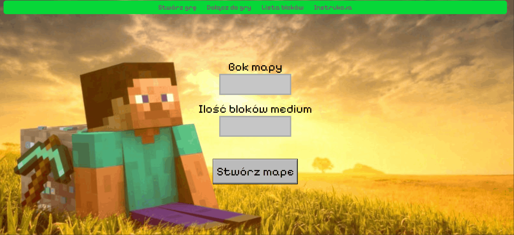
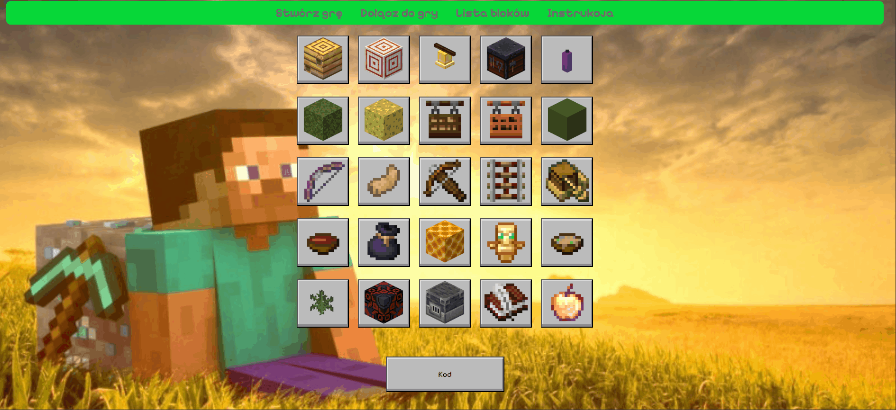
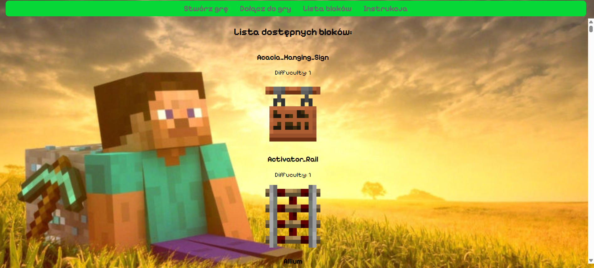

# mc_bingo
Web app for tracking progress while playing bingo in Minecraft, featuring an automatic board generator.

## Features

+ Marking which block/item was found
+ Generating board
+ Editable boards
+ Editing board properties
+ Loading board by code (items separated by colons)
+ Overview of items

## Demos and Screenshots

### Creating board


### Importing board


### List of items


## Tech Stack


## How to run
```bash
git clone https://github.com/Lynxman21/mc_bingo.git
cd mc_bingo
npm install
npm start
```